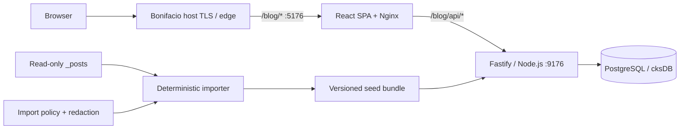

# Bonifacio Notes

Bonifacio의 중계 역할을 건드리지 않고 독립적으로 실행되는 데이터베이스 기반 기술 블로그다. 공개 주소는 `https://bonifacio.work/blog/`, API namespace는 `/blog/api/`이며, `main` 검증이 끝난 정확한 commit SHA의 두 Docker image만 Raspberry Pi 5에 배포하도록 구성되어 있다.

현재 원본 `_posts` 195개를 안전하게 감사·분류한 결과, 121개가 PostgreSQL seed bundle에 보존되고 그중 명시적으로 공개 가능하며 보안 검사를 통과한 Markdown 32개만 웹과 API에 나타난다. 원본 폴더는 읽기 전용 입력으로 취급하며 이 저장소의 작업은 원본을 수정하지 않는다.

## 완성된 구성



- `apps/web`: React 19, React Router, Framer Motion, Vite, 로컬 Fontsource 폰트
- `apps/server`: Node.js 22, Fastify 5, PostgreSQL, Zod, Marked, sanitize-html
- `content/seed/posts.json`: 재현 가능한 DB seed bundle
- `apps/server/migrations`: advisory lock을 사용하는 순차 PostgreSQL migration
- `apps/web/nginx.conf`: `/blog/` SPA와 `/blog/api/` reverse proxy
- `.github/workflows`: Validate 성공 SHA만 ARM64 image로 빌드·smoke·publish·배포 요청

## 사용자 경험

홈은 freesourc.es에서 관찰한 “고정 인덱스 + 활자 중심 스크롤 목록” 문법을 Blog에 맞게 확장한다. 검정·종이색·회색·lilac의 제한된 팔레트와 선·공백 중심의 정보 구조는 유지하되, 실제 Blog 콘텐츠가 좁아지는 901px 미만에서는 tablet까지 단일 열 Index로 전환한다. 320px mobile부터 2560px ultrawide 및 짧은 landscape까지 별도 viewport 검증을 거치며 다음 상호작용을 추가했다.

- DB 기반 최신 글 32개와 카테고리별 필터
- `/` 키 또는 Search 버튼으로 여는 전체 화면 lilac 검색
- 검색어·카테고리·본문을 대상으로 하는 PostgreSQL 검색
- sanitized article HTML, syntax highlighting, 읽기 진행률, 관련 글
- heading이 충분한 글의 sticky 목차
- 모바일 전체 화면 Index, 터치 크기 보장, 키보드 Escape 종료
- `prefers-reduced-motion`에서 부유·reveal·slide 모션 제거
- 홈 OG card와 글별 title/description/canonical metadata

조사 근거와 독자적 변형의 경계는 [디자인 조사 문서](docs/DESIGN_RESEARCH.md)에, 실제 viewport·콘텐츠 순회 결과와 재검증 계약은 [반응형 QA 기록](docs/RESPONSIVE_QA.md)에 기록했다.

## 로컬 실행

Node.js `22.23+`와 PostgreSQL이 필요하다.

```sh
npm ci
createdb bonifacio_blog_dev
npm run content:bundle -- --source /absolute/path/to/_posts
npm run dev
```

기본 주소는 다음과 같다.

- Web: `http://127.0.0.1:5176/blog/`
- API: `http://127.0.0.1:9176/blog/api/`
- API health: `http://127.0.0.1:9176/blog/api/health`

PostgreSQL 접속값이나 포트를 바꾸려면 `.env.example`을 참고해 shell environment로 제공한다. 실제 비밀번호가 들어간 `.env`는 commit하지 않는다.

Docker가 있는 ARM64 환경에서는 branch별 인증 계약을 resolver가 설정한 상태로 로컬 stack을 띄울 수 있다.

```sh
scripts/portfolio-auth-mode.sh exec -- docker compose up --build
```

## 콘텐츠 가져오기와 공개 정책

가져오기는 명시적 allow-to-publish 정책이다.

| 상태          | 수량 | 공개 API  | 의미                                                 |
| ------------- | ---: | :-------: | ---------------------------------------------------- |
| `published`   |   32 |    예     | 유효한 frontmatter의 `published: true` 안전 Markdown |
| `review`      |   80 |  아니오   | frontmatter 없음/오류, HTML/text, 수동 보안 검토     |
| `draft`       |    8 |  아니오   | 명시적인 `published: false`                          |
| `quarantined` |    1 |  아니오   | 실제 자격증명 형태가 발견되어 강제 격리된 글         |
| skipped       |   74 | 해당 없음 | 빈 파일, 렌더 불가 파일, PDF/SQL/CSV 등의 보조 자료  |

```sh
npm run content:bundle -- --source /Users/cksmacbook/Desktop/Develop/Project/_posts
```

가져오기는 경로 순서, Unicode NFD/NFC, slug 충돌, `Asia/Seoul` 날짜, 손상 frontmatter를 결정적으로 처리한다. raw HTML은 Markdown에서 실행되지 않으며 standalone HTML은 script/form 등을 제거한 뒤에도 review 상태에만 둔다. 자격증명 패턴은 DB에 쓰기 전에 `[REDACTED BY IMPORTER]`로 바뀐다.

상세한 감사 결과와 편집자가 글을 공개 상태로 옮길 때의 절차는 [콘텐츠 가져오기 문서](docs/CONTENT_IMPORT.md)를 따른다.

> 중요: 원본 `Web/ㅁ http vs https.md`에서 실제 ngrok authtoken 형태의 값이 발견되었다. 이 저장소의 bundle에는 값이 남지 않지만, 해당 자격증명은 제공자 측에서 폐기·회전하고 원본·backup·cache도 별도로 점검해야 한다.

## API

읽기 전용 공개 API만 제공한다. draft/review/quarantined row는 목록·검색·상세 모두에서 제외된다.

| Method | Path                    | 설명                                       |
| ------ | ----------------------- | ------------------------------------------ |
| GET    | `/blog/api/health`      | PostgreSQL까지 포함한 readiness            |
| GET    | `/blog/api/meta`        | 공개 글·카테고리 통계                      |
| GET    | `/blog/api/posts`       | `q`, `category`, `page`, `limit` 목록 검색 |
| GET    | `/blog/api/posts/:slug` | sanitized 본문과 같은 분류의 관련 글       |

쓰기/admin API는 의도적으로 열어 두지 않았다. 향후 추가할 때는 Bonifacio edge SSO와 Blog 전용 edge secret으로 admin route만 보호해야 하며, 독립 비밀번호나 공개 mutation endpoint를 만들면 안 된다.

## 품질 검증

```sh
npm run format:check
npm run lint
npm run typecheck
npm test
npm run build
npm audit --omit=dev --audit-level=high
```

Server test는 importer 결정성·redaction 멱등성·HTML sanitizer·실제 195개 bundle 계약과, 충돌 없는 임시 PostgreSQL을 사용하는 migration/seed/API 통합 검증을 포함한다. Web test는 DB 목록, 검색 단축키와 Escape, 상세 route 및 metadata를 검증한다.

## 배포

`Validate` workflow가 format/lint/typecheck/test/build/audit와 Compose 선언을 통과해야만 `workflow_run` deploy가 시작한다. 배포 workflow는 검증된 40자 SHA를 다시 확인하고 ARM64에서 다음 이미지를 만든다.

- `ghcr.io/facio313/blog-server:<exact-sha>`
- `ghcr.io/facio313/blog-web:<exact-sha>`

먼저 server Docker `test` target을 ARM64에서 빌드해 branch/auth provenance, typecheck, importer·redaction·renderer 계약을 다시 검증한다. 두 runtime 이미지는 push 전에 실제 PostgreSQL과 격리 network에서 migration, seed, API, SPA fallback, cache/security header, non-root/read-only 실행을 smoke-test한다. `main`만 GHCR에 push하고 제한 SSH 명령 `deploy blog <exact-sha>`를 요청한다. `latest` tag는 사용하지 않는다.

RPi의 host Nginx route, `cksDB` 전용 database/role, forced deployer의 `blog` allowlist, Bonifacio 랜딩 카드 등록은 공용 host 저장소에 있는 별도 운영 surface라 이 저장소에서 임의 변경하지 않았다. 최초 활성화와 backup/rollback 계약은 [운영 문서](docs/OPERATIONS.md)에 있다.

## 디렉터리

```text
apps/
  server/     Fastify API, migration, importer, tests
  web/        React UI, Nginx runtime, tests, OG asset
content/
  import-policy.json
  seed/posts.json
docs/
  CONTENT_IMPORT.md
  DESIGN_RESEARCH.md
  OPERATIONS.md
scripts/
  portfolio-auth-mode.sh
.github/
  workflows/ci.yml
  workflows/deploy.yml
```
